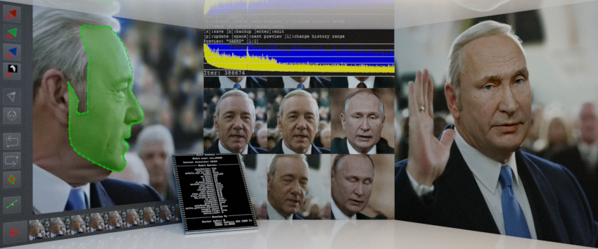

# DeepFaceLab  

<a href="https://arxiv.org/abs/2005.05535">

</img>
https://arxiv.org/abs/2005.05535</a>

### The leading software for creating deepfakes

## Using

### 1. Prepare dataset
Put two videos "data_dst.mp4" and "data_src.mp4" to the folder ./data
"data_dst.mp4" -  target video onto which we swap faces.
"data_src.mp4" - the video with the person whose face you want to swap onto the target video.

## 2. Navigate in the scripts directory using entry.ipynb:
Run all shells in the notebook
